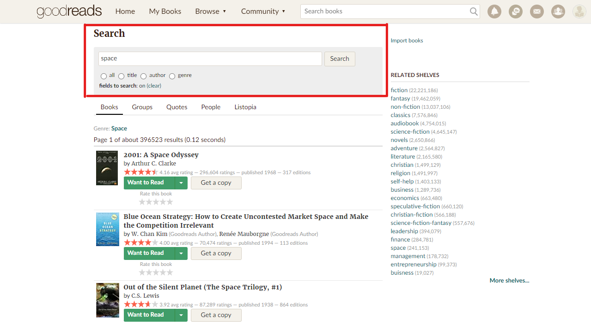

# Bookstore Database

## Introduction
I like to read and use the Goodreads app/website to track my reading. 
It allows you to keep track of books you have read, are currently reading, and want to read in the future. 
The purpose of this project is to gain experience with APIs (Spring Boot) and SQL databases (Postgres) by programming a custom search engine.

## Problem Statement
I sometimes have trouble deciding on my next book to read. 
Rather than using Goodreads recommendations, I would rather search for books depending on my mood at the time. 
However, as you can see in this example, Goodreads search options are quite limited with only 4 filter options; "all", "title", "author", or "genre".  
  
I often find myself using Google searches such as "best space sci-fi books all-time" or "top tech thriller book of the last 15 years". 
I end up spending a lot of time browsing lists from different sources unable to make a decision based on someone else's subjective opinions. 
I would like a way to run an advanced, custom search on the Goodreads database.

## Solution
Download the Goodreads book dataset and create an advanced search and filter engine. 
The API can include specific filters like avg. rating, number of ratings, number of pages, year published, genre, author, awards, etc. so that I can create a specialized search.

## Technologies
- Postgres (use multiple tables for interacting with a relational database)
- Docker
- JPA
- Spring Boot

## Resources
- Goodreads Dataset   
*If you are using our datasets, please cite the following papers:
Mengting Wan, Julian McAuley, "Item Recommendation on Monotonic Behavior Chains", in RecSys'18.  [bibtex]
Mengting Wan, Rishabh Misra, Ndapa Nakashole, Julian McAuley, "Fine-Grained Spoiler Detection from Large-Scale Review Corpora", in ACL'19. [bibtex]*

  - https://sites.google.com/eng.ucsd.edu/ucsdbookgraph/home
  - https://github.com/MengtingWan/goodreads

- Searching And Filtering Using JPA Specification - Spring Boot
  - https://blog.piinalpin.com/2022/04/searching-and-filtering-using-jpa-specification/#using-search-specification

