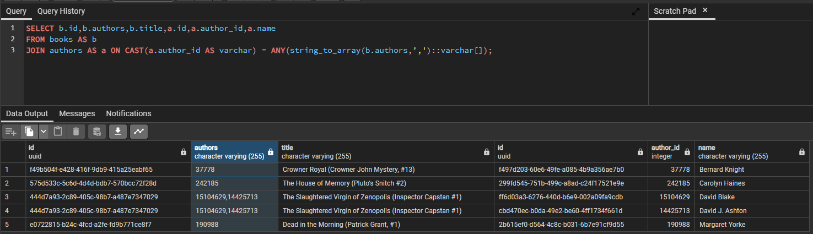
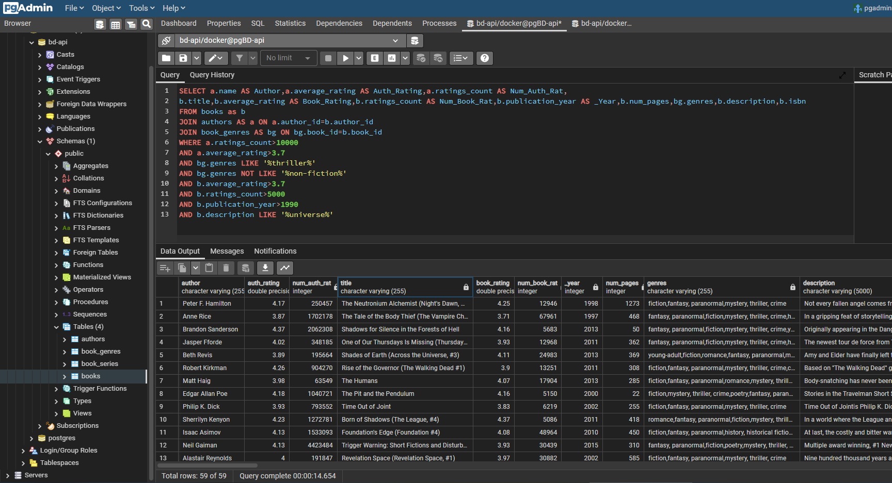

# Accomplishments & Reflections

### Week 1 
* 2/10/23  
  * Researched ideas for an **SQL database** project.   
  * Decided on a book database based on Goodreads so that I can implement custom search filters.
  * Initialized a repo and project using **Spring Initializr**.
  * Created README in word  
  * Created Design Doc in word  


* 2/11/23
  * Created an accomplishment tracking   
  * Installed plugin to create builder pattern  
  * Created Book entity  
  * Created BookRepository  
  * Created BookService with basic **CRUD operations** (Still need to work on custom filtering)  
  * Created BookController  
  * Working on configuration for **Postgres** and **Docker**. It currently runs into an error related to 'authors' in the table.  

2/12/23
* The **JSON** format for Book has 2 lists of objects; popular_shelves and authors. 
  I incorrectly coded the attributes as List<List<>> instead of List\<Object>. 
  I updated and created classes, however I am still getting **JPA/Hibernate** errors for mapping these columns. 
  I am researching JPA fields and annotations.  
  * If a persistent field is a Collection type, it must include the annotation _**@ElementCollection**_
  * List\<Role> and List\<Shelf> are embedded classes:
    * **Embeddable** classes are used to represent the state of an entity but don’t have a persistent identity of their own.  
    * **_@Embeddable_** annotation is used above the class declaration.
    * **_@Embedded_** can be used in the @Entity class but is not required.
  

  * Now I'm getting error org.hibernate.exception.GenericJDBCException: Unable to open **JDBC** Connection for DDL execution
    * My **Docker** configuration previously ran with template variables and saved it to the data/pg folder.
      I corrected the variables, deleted the pg data, and re-ran docker setup to fix the issue.  


### Week 2
* 2/13/23  
  Researched **JSON** objects and libraries.
    
  * **Gson** is easy to use, standardized, efficient, optimized, and does not require libraries apart from JDK.
  * Added the Gson dependency in the gradle build.
  * Successfully deserialized a JSON string to a Book object


* 2/14/23  
  Imports stopped working in this project.
    
  * I spent hours trying to figure this out with no solution. It seems to be related to either an IDE(IntelliJ) or **Gradle** issue.
    * Older projects were unaffected.
    * I tried invalidating caches and restarting IntelliJ
    * I tried deleting the .idea and build directories to rebuild the project.
    * Another recommendation was to uninstall/reinstall IntelliJ. (Did not do this since other projects were unaffected.)
  * After starting a new Gradle project with **Spring Initializr** and copying the packages/files, the imports are working again.


* 2/15/23  
  * **Seeding** the Book database:
    * Initial issue is the zipped file is a list of JSON strings separated by lines. So, I need to figure out how to iterate the file by line, convert to a Book object, and save to the DB.  
      * I first tried to unzip the file and use a buffered reader which resulted in a very large file.
      * After referencing the Goodreads dataset **project documentation**, I found a function in **Python** on how to load the data by reading a Gzip file.  
        * https://github.com/MengtingWan/goodreads/blob/master/samples.ipynb
        * Used this as the basis to create my BookSeeder class.

    * Issue with the **primary key**/id:
      * Failed to execute CommandLineRunner...Unknown integral data type for ids : java.lang.String;
      * ISBNs are unique numeric identifiers, so I thought I could use them as the primary key. 
        The issue is they are all strings in the JSON data set. **Hibernate** does not like this since it is a String.
        * Should I convert these to Integers or use a generated **UUID** as the primary key?
        * ISBN is a numeric identifier assigned by publishers. -> I do not want to auto-generate these.
        * For purposes of this project (return a recommendations list of filtered results), there is no need to lookup a book by a single ISBN or key.
      * Solution is to modify code base to use **UUID** as a **primary key** and make ISBN a normal field/column. 

    * Application now runs with error Caused by: **org.postgresql.util.PSQLException**: ERROR: value too long for type **VARCHAR(255)**
      * bookDescription is too long for default varchar 255. Updated the @Column(length = 10000);

* 2/16/23
  * Problem: BookSeeder runs but does not populate all columns. Some have null data.
    * **Deserializing** using gson.fromJson() to a Book object is not working for all fields due to the use of **camel case** in my code vs **snake case** in the JSON file.  
    * (Initial) Solution:
      * In the **Gson documentation**, you can use **@SerializedName**("custom_naming"), however since this is a common convention it also provides **FieldNamingPolicy** to auto convert all instances!
      * ```builder.setFieldNamingStrategy(FieldNamingPolicy.LOWER_CASE_WITH_UNDERSCORES);```
  
  * All numbers and booleans are stored as Strings in the JSON dataset. For better practice and a learning opportunity, determine how to convert these while seeding the data.
    * Will need to convert all field types to Integer
      1. ~~isbn Integer~~  Some ISBNs have a trailing letter.
      2. text_reviews_count Integer
      3. series List<Integer>
      4. popular_shelves -> Shelf count;
      5. isEbook -> Boolean
      6. average_rating Double
      7. similar_books List<Integer>
      8. authors -> Role authorId Integer
      9. num_pages Integer
      10. publication_day Integer
      11. publication_month Integer
      12. publication_year Integer
      14. ratings_count Integer
    * Use Gson documentation for a strategy or tool to convert String to Integer
      * Implement a **custom deserializer** _public class BookDeserializer implements **JsonDeserializer**_ to convert specific fields.
        (This will render the FieldNamingPolicy described above redundant.)  
      * The purpose of converting to Integer in the database is for **scalable** and efficient querying. 
        By converting the Strings to Integer at the initial seeding, these types will not need to be converted every time a filter is imposed. 
        For example, published between the year 1990 and 2000 would need to convert a String  e.g. "1995" to int 1995 for millions of books in the database.

* 2/19/23
  * Testing API in Postman:
    * Issue: responses show a Book object with "ebook" last instead of corresponding "isEbook" field in order
      * Solution: _@JsonProperty_ annotation; 
        The name & order were due to serialization automatically returning the property by the related getter method name instead of field name. 
        It removes "get" or "is" by default. (e.g. getIsbn -> isbn, isEbook -> ebook)
    * Task: add GET request that can filter on 1 to many parameters if present.
      * Need to research documentation on how to do this.
        * Spring Boot JPA [https://blog.piinalpin.com/2022/04/searching-and-filtering-using-jpa-specification/](https://blog.piinalpin.com/2022/04/searching-and-filtering-using-jpa-specification/)
          * Sort enums
          * class SortRequest implements Serializable
          * class SearchRequest implements Serializable
          * class SearchSpecification implements Specification
          * then in the Service want to make a searchBooks(SearchRequest) which returns a Page

### Week 3

* 2/20/23
  * Spring Data JPA Querying
    * I tested query creation by defining methods in the BookRepository.
      * By combining subject and predicate keywords, JPA can query the database.
        * e.g. ```public List<Book> findByLanguageCodeIgnoreCaseAndTextReviewsCountGreaterThan();```
      * This works in specific cases but not for 1 to many filters as you don't know how many criteria filters and which ones will be used.
    * Try using Sort objects as parameters
      * List<User> findByLastname(String lastname, Sort sort);
      * Sort sort = Sort.by("firstname").ascending()
        .and(Sort.by("lastname").descending());
    * Limit results by keyword first or top 
      * e.g. find*First10*ByLastname(String lastname);
    * Could possibly return a Streamable or Iterable to .filter() elements but this would return every item in the database to filter locally.
    * [Customizing a repo](https://docs.spring.io/spring-data/jpa/docs/current/reference/html/#repositories.single-repository-behavior)
    * [Querydsl Extension](https://docs.spring.io/spring-data/jpa/docs/current/reference/html/#core.extensions.querydsl)
      * framework that enables the construction of statically typed SQL-like queries
    * [Query By Example](https://docs.spring.io/spring-data/jpa/docs/current/reference/html/#query-by-example)
      * Well suited for querying your data store with a set of static or dynamic constraints
      * limitations 
        * No support for nested or grouped property constraints
        * Only supports starts/contains/ends/regex matching for strings and exact matching for other property types
    * SOLUTION excellent example by Alvinditya Saputra on PiinAlpin:
      * [Searching And Filtering Using JPA Specification - Spring Boot](https://blog.piinalpin.com/2022/04/searching-and-filtering-using-jpa-specification/#using-search-specification)
* 2/21/23
  * Implemented classes and code from solution above.
  * The "/search" endpoint can now take a dynamic request body with a list of filters and sorts as well as page and size input for pagination.
    * Example:  
    
* 2/22/23
  * MVP was accomplished for BD-6 creating Book entity, API endpoints, and seeder.
  * Merged to main branch
  * Next up I want to refine searches and returned items.
* 2/24/23
  * Created new branch BD-13-search for refining search methods
  * Problem: the resource I used for search & filter did not include greater than or less than in enums.
    * Solution: I added enums for filtering based on GREATER_THAN, GREATER_THEN_OR_EQUAL_TO, LESS_THAN, & LESS_THAN_OR_EQUAL_TO
    * This hung me up for a bit. 
      I realized I was using the wrong CriteriaBuilder method _greaterThan(Expression<? extends Y> x, Y y)_ versus _gt(Expression<? extends Number> x, Number y)_. 
      I needed to use the Expression extending Number type when comparing numbers.
  * Tested /search endpoint with only page and number providing no Filter or Sort. This acts the same as findAllBooksPaginated() method, so I could potentially remove that as a redundancy. 
* 2/25/23
  * Tested /search endpoint using _IN_ and _LIKE_ Operators
    * _LIKE_ can be used to search a description for a keyword.
    * I would like to create a _CONTAINS_ Operator that tests if contains on a list of keywords.
  * Added java doc comments.
  * Revised README problem statement slightly with Goodreads screenshot.
  * **To better understand the search and FilterRequests, I want to step into the code using a debugger.**
    * Goal is to configure a remote debugger.
    * Running into a lot of issues not fully understanding how to configure remote debugger. 
      Review these sources for help:
      * https://www.jetbrains.com/help/idea/debug-a-java-application-using-a-dockerfile.html
      * https://www.jetbrains.com/help/idea/run-and-debug-a-spring-boot-application-using-docker-compose.html
      * https://www.baeldung.com/intellij-remote-debugging
      * Maybe start here spend a day or more learning more about Docker: https://docs.docker.com/get-started/overview/
      * https://stackoverflow.com/questions/37702073/gradle-remote-debugging-process

### Week 4
* 2/27/23
  * After a break this was much easier than I was making it out to be.
    
  * CriteriaBuilder does not have a _contains_ method, but I can use a conjunction of predicates to combine multiple like() predicates.  
    * Modifying enum ```Operator.LIKE```:
      * Create a Predicate array from the existing FilterRequest List<Object> values field.
      * Use ```cb.and(predicatesArray)``` conjunct the array to a single predicate.
      * Original implementation for one pattern: 
      ```
      LIKE {
            public <T> Predicate build(Root<T> root, CriteriaBuilder cb, FilterRequest request, Predicate predicate) {
                Expression<String> key = root.get(request.getKey());
                return cb.and(cb.like(cb.upper(key), "%" + request.getValue().toString().toUpperCase() + "%"), predicate);
                }
            }, 
      ```
      * New implementation to match 0 to many patterns:
      ```
        LIKE {
            public <T> Predicate build(Root<T> root, CriteriaBuilder cb, FilterRequest request, Predicate predicate) {
                Expression<String> key = root.get(request.getKey());
                Predicate[] predicatesArray = request.getValues().stream()
                                                        .map(object -> cb.like(cb.upper(key), "%" + object.toString().toUpperCase() + "%"))
                                                        .toArray(Predicate[]::new);

                return cb.and(cb.and(predicatesArray), predicate);
            }
        },
      ```
  * Problem: if statements for logging and returning predicate returns all items.
    * I'd rather return no results or an error.
* 3/2/23
  * Commit and merge updates to main branch.
  
* 3/3/23
  * Reduce the Book object and/or JSON response fields 
    * ```@JsonIgnore``` annotation instructs serialization of the JSON object to Book to ignore designated fields.  
      This keeps the data in Postgres to allow for searching but does not return it in the response. 
      * popularShelves is a long list which is not needed for the response, however it can be useful in filtering based on how many shelves the book is in.
      * publisher is not important to me at the moment but might prove useful later for searching. Leaving it as ignored for now.
    * The following fields are irrelevant. I removed these from the Book entity all together to save space in the database.
      * publicationDay
      * isbn13
      * publicationMonth
      * workId
  * Added java doc comments.

### Week 4
* 3/7/23
  * Considering whether to include NULL/NOTNULL Operator enums.
    * Due to the data set JSON file of all Strings and my ```BookDeserializer``` implementation, the only fields that would be null are numbers.  
    * When searching "number" fields, null values will be excluded for operators
    * All other fields will return an empty string or list if data is absent.
    * For the scope of this project, NULL & NOT_NULL Operators are not needed.
  * Author
    * Created classes and basic methods for Author entity, repo, service, controller, and exception. 
* 3/8/23
  * Created custom ```AuthorDeserializer``` and ```AuthorSeeder``` classes
  * Merged to main branch and pushed to remote.
  * Investigated dataset Book popular_shelves vs. Genres.
    * Genres are much shorter lists and appear to be more accurate.
    * popular_shelves within a Book object has a long list of what appears to be arbitrary "shelf/genre" based on how individual readers classify the book.
    * _Determination: When searching for genre, Genre will return more accurate results and also be a much faster query._
      * For example book_id 33394837: 
        * Genre object has list of 4 encompassing genres
        * Book popular_shelves has a list of appx. 100 "shelves" a lot of which are not genres and appear user-specific (e.g. "to-read", "owned", etc.)
  * BookGenre
    * created entity, repo, service, controller, and exception
    * working on deserializer
* 3/10/23
  * Created custom BookGenreDeserializer
  * Created BookGenreSeeder

### Week 5
* 3/17/23
  * BookGenre genres refactoring:
    * Restructure BookGenre so the field List<Genre> with embedded object is simply a String.
    * Deleted Genre model
    * Reconfigured custome BookGenreDeserializer
  * Book List<Role> authors refactoring:
    * After looking at the data further in the list of authors with authorId & role, the role is almost always blank and therefore does not need an embedded object. It can be a List<Integer> of the authorId.
    * Simpler yet I can concatenate all authorIds and use LIKE operator to see if an author is part of a String of all authors for a boook.
    * Refactored Book List<Role> to String
    * Deleted embedded model class Role
    * Reconfigured custom BookDeserializer
  * Problem: in testing SQL commands in Postgres I noticed Author authorId field is auto generated as the key and not the correct id in the dataset.
    * to correct this and make code consistent with other classes I added UUID id as the primary key.
    * The JOIN command in Postgres is working now:
       

### Week 6
* 3/20/23
  * Endpoints for ```Author```,```Book```, & ```BookGenre``` are all working.
  * Now I want to combine them to search on all 3 with one request.
  * Researching Spring Boot/JPA JOINs, I see I need to migrate 2 Book attribute types
    * Book String bookId -> Integer bookId to match BookGenre Integer bookId;
    * Book String authors -> List<Authors> create an Author object with only the author_id
      * Problem  "object references an unsaved transient instance - save the transient instance before flushing" error"  
      * Adding @OneToMany(cascade = CascadeType.ALL) annotation helped but created new Authors in the table.
        * creates duplicate author with null values since author_id is not the primary key
        * What CascadeType should I use?
* 3/21/23
  * Exception when trying to seed database with Book List<Author> authors
    * org.hibernate.TransientObjectException
    * By using @OneToMany(cascade = CascadeType.ALL) annotation it runs but saves a new author to the table
    * The issue is the data for each Book does not actually contain an Author object as represented in the table
    * Refactoring again to Book List<Integer> authors which is a list of author ids.

* 3/23/23
  * Joining tables and database keys problems
    * I was quick to use UUID as primary for ISBN and then adopting it for Author & BookGenre
      * Joining tables and keys makes more sense for the layout and simplifies not using UUIDs that are not needed.
    * PLAN:
      * Book UUID still needed since some ISBNs are missing in the dataset.
      * Author - convert primary key to Integer authorId
        * Updates needed to annotations, methods, REPO, deserializer 
        * delete UUID id
        * Book Integer authorId in Book is already updated to Integer and serves as join column
      * BookGenre - convert primary key to Integer bookId
        * Updates needed to annotations, methods, REPO, deserializer
        * delete UUID
        * Book Integer bookId already Integer and serves as join column

* 3/25/23
  * Book: unnecessary attributes removed to reduce database size
    * text_reviews_count, country_code, popular_shelves, asin, is_ebook, kindle_asin, similar_books, format, link, publisher, publication_day, isbn13, publication_month, edition_information, url, image_url, work_id  
  * Seeded full database ~830K Authors, ~2.4M BookGenres, and 1.7M Books (excluded descriptions over 5000 char and null publication year)
  * SQL search JOINing tables is looking good:
      

  * **RETROSPECTIVE**:
    * BooKGenres (~2.4M items total)
      * genres field does not contain "science-fiction" or "sci-fi". 
      * Should I revert to including Book popular-shelves field?
      * If Books are seeded first, can I seed BookGenre only if the book_id exists in Books?
    * Books (1.7M items total)
      * By excluding Book descriptions over 5000 chars and null publication years, ~600K Books were not persisted to the database.
      * _Increase limit on the length of description._
      * ~630K Books have <= 10 ratings_count
      * ~165K Books have no description
      * ~248K Books have null value for num_pages
        * Overlap of no description and null num_pages is only ~35K books
      * ~705K books have a no language_code value
    * Authors (~830K items total)
      * ~241K authors have <= to 10 ratings_count
    * **_I can significantly reduce the size of the databases based on these figures._**

### Week 6
* 3/28/23
  * Reducing database size
    * Books 
      * Exclude books with than 1000 ratings and no description.
    * Authors & BookGenres
      * Exclude if Book is not persisted to database.
      * PROBLEM initializing Spring components in order???
      * Create configuration class with @Bean & @DependsOn instead of using @Component?
    * IS findBookByBookID() even working???
      * add method to BookController and test in Postman
* 3/30/23
  * Added and tested endpoints findByBookId() & findByAuthorId()
  * **_Idea comment out @Component for AuthorSeeder and BookGenreSeeder so that Books seeds first.  
    Then add, so they can check if Books exist._**
    * Appears to work at first but then throws error for non-unique result since multiple books have the same author.
      * Change findByAuthorID() to findFirstByAuthorId()
    * Working but the bigger issue is now the time it would take. For every Author and BookGenre is first scans the Book data to see if the book exists drastically increasing the seed time.  
      * Process is sped up by checking for null object directly on bookService method rather than instantiated a new object then checking if it is null.
    * RESULT (on 1_000 books)
      * Seeded 1_000 Books, 1_000 matching BookGenres, & 839 Authors (due to multiple books by an author)  
    * WAS IT ACTUALLY WORKING BUT TAKING TOO LONG???
      * Seeding Authors with >= 1000 ratingsCount;
      * When done try SQL query join on books with no author
    * RETRO
      * Seeding Books first, then Authors & BookGenres separately while checking if the Book exists reduces Books table and only seeds matching Authors and BookGenres. 
        * HOWEVER, seeding times increases exponentially needing to check the Books table for every Author & BookGenre
        * Should I seed all BookGenres instead?
        * Maybe seed only Authors with 1000+ ratings. It could possibly lead to null results but would find Book/Author combos for most queries.
          * Are there Books with missing author data??
      * I think my timing issue of trying to seed all 3 tables in order at the same runtime, is a limitation of Spring Boot vs Spring configuration. 
        I tried to use ```@DependsOn``` annotation and instantiating dependencies in the seeder so BookSeeder ran first but would get stuck in endless loop.  
* 4/1/23
  * Finished modifying seeders and committed and pushed branch.

### Week 7
* 4/4/23
  * 


HOW DO I BUILD A PREDICATE WITH CRITERIABUILDER THAT SEARCHES A LIST OF OBJECTS?????  
* Separate enums for CONTAINS_GENRE and CONTAINS_AUTHOR??

* should I create an Operator OR?

## TODO
* **Create endpoint/search to JOIN the tables Books, Authors, & BookGenre**
* Create API documentation (maybe use Swagger or RapidDoc)
* Modify API HTTP responses to include message with status code.
* Create architecture diagram 
* UML workflow diagrams
* UI diagrams (Try using Whimsical or Figma)
* Security protocols with OAuth
* Improve **scalability**:
  * Implement logging to document performance before and after
  * Implement pagination (or Slices)
    * The first method lets you pass an org.springframework.data.domain.Pageable instance to the query method to dynamically add paging to your statically defined query. 
      A Page knows about the total number of elements and pages available. 
      It does so by the infrastructure triggering a count query to calculate the overall number. 
      **_As this might be expensive (depending on the store used), you can instead return a Slice._** 
      A Slice knows only about whether a next Slice is available, which might be sufficient when walking through a larger result set.
  * Implement caching
    * I could create GET methods of Top n Books all time for categories
    * Or Top n books by author
    * Highest Rated authors
    * Use Spring query creation with property expressions for nested properties
      * e.g. try findByTextReviewsCountGreaterThanAndLanguageCodeAndPopularShelvesNameContainingOrderByAverageRatingDesc():
        * PopularShelvesNameContaining -> ?? use specific genre like "fantasy"

