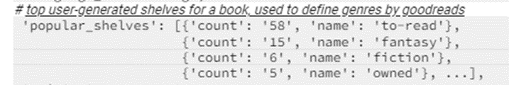
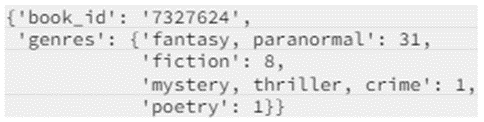

# Bookstore Database Design Document

## 1. Problem Statement
I sometimes have trouble deciding on my next book to read. Rather than using Goodreads recommendations, I often find myself using specific Google searches such as "best space sci-fi books all-time" or "top tech thriller book of the last 15 years" depending on my mood at the time. I end up spending a lot of time browsing lists from different sources unable to make a decision based on someone else's subjective opionions. I would like a way to run a more specialized search depending on my mood at the time.

## 2. Top Questions to Resolve in Review
List the most important questions you have about your design, or things that you are still debating internally that you might like help working through.
1. The dataset if very large. Should I make a working app with a smaller subset genre first?
   1. *This could be a good opportunity to implement pagination and caching.*
2. I want to incorporate multiple tables for practice with relational tables. Are there related tables I can use and if so which ones?
   1. Books (Meta-Data of Books)
      1. Detailed book graph
      2. Detailed information of authors
         1. use author ID from books to find author avg rating and ratings count
      3. Detailed information of book series
         1. Might be useful to find number of books in the series -> maybe I only want to find trilogies
      4. Extracted fuzzy book genres
         1. This a very fuzzy version of book genres. These tags are extracted from users' popular shelves by a simple keyword matching process.
         2. Use this one to search by genres 
            1. Book object has "popular shelves"; how is this different from fuzzy genre?
               popular shelves:
                 
               "fuzzy" genre:  
                 
   2. Shelves (User-Book Interactions)
      1. This is individual reader history for books read, to read, personal rating, etc.
      2. Is this related to "popular shelves" from the book dataset?
   3. Reviews (Book Review Texts)
      1. Dataset of book reviews by Goodread users
      2. Might be relevant to get a more detailed opinion
      3. Maybe I am able to find a user with similar tastes and can make recommendations from their ratings.
3. How will I seed the database from the JSON dataset?
4. Should I include all basic CRUD operations for practice or focus on retrieving and filtering results?
5. Should I incorporate recommendations based on the books I already read or solely focus on a search filter for recommendations?
   1. This would incorporate Shelves dataset. For now I think this will be out of scope.

## 3. Use Cases
1. As a user, I want to run a search on 1 to many filters to return a list of books meeting the criteria. 
2. As a user, I want to search based on if a book is a series.
3. As a user, I want to search based on only books that are in English language_code
4.	As a user, I want to search based on a book's range or minimum average_rating
5.	As a user, I want to search based on a book's authors.
6.	As a user, I want to search based on a book's publisher.
7.	As a user, I want to search based on a book's min, max, or range of num_pages.
8.	As a user, I want to search based on a book's min, max, or range of publication_year.
9.	As a user, I want to search based on a book's min number of ratings_count.
10.	As a user, I want to search based on an author's average_rating.
11.	As a user, I want to search based on an author's number of ratings_count.
12.	As a user, I want to search based on genres.
13.	As a user, I want to see a list of similar books (Book attribute 'similar_books') based on Goodreads recommendations.
14.	As a user, I want to search books that have certain words in the title.
15.	As a user, I want to search books that have certain words in the description.
16.	As a user, I want a easy to use website to consume the API.

## 4. Project Scope
### In Scope
Include 3.1 to 3.12 for this projects scope to customize searches.

### Out of scope
3.13 This feature is already available within the Goodreads app/website. I can keep this in mind for additoinal custom recommendations to refine already recommended books.  
3.14 Keywords in titles would be less useful especially for fiction books.  
3.15 Keywords in description might be a good candidate to expand scope in the future.  
3.16 Creating a website   

## 5. Proposed Architecture Overview
The initial iteration will provide the MVP of retrieving data from the Bookstore database based on filter criteria. Create, update, and delete operations will not be implemented.

Using Spring Initializer and Spring Boot for the API, I will create an endopint GetBookRecommendations that will handle GET RESTful requests.

The book dataset will be stored in a Postgres database. 
The project will use a Docker container to create a local server which can be tested using Postman.

## 6. API

### 6.1 Data models  
```
// Book  
String isbn; (partition key)  
String text_reviews_count;  
List<String> series;  
String country_code;  
String language_code;  
List<List<String>> popular_shelves;  
String asin;  
String is_ebook;  
String average_rating;  
String kindle_asin;  
List<String> similar_books;  
String description;  
String format;  
String link;  
List<List<String>> authors;  
String publisher;  
String num_pages;  
String publication_day;  
String isbn13;  
String publication_month;  
String edition_information;  
String publication_year;  
String url;  
String image_url;  
String book_id;  
String ratings_count;  
String work_id;  
String title;  
String title_without_series;  
```
```
// Author  
String average_rating;  
String author_id; (partition key)  
String text_reviews_count;  
String name;  
String ratings_count;  
```
```
// Genre  
String book_id; (partition key)  
Map<String, Integer> genres;  
```

### 6.2 GetBookRecommendations
* Accepts GET requests to /bookrecommendations
* Accepts JSON body with optional filters to search for results
* If no JSON body is provided, default return is books sorted by highest rating.
* Initially limit results to top 20 items.

